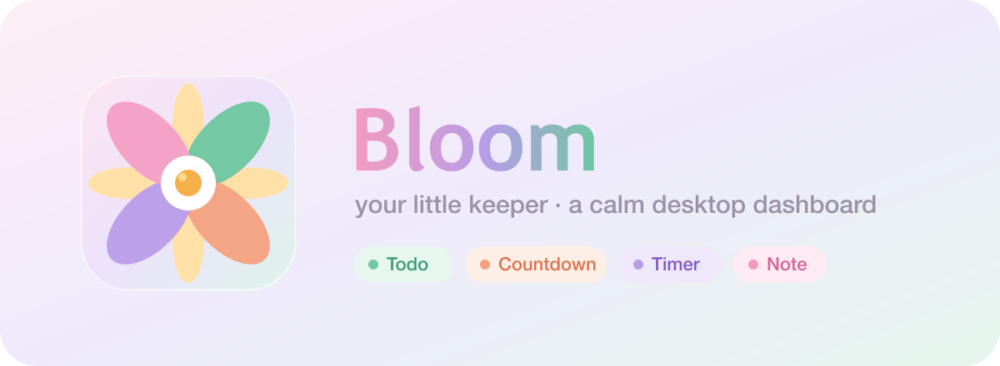
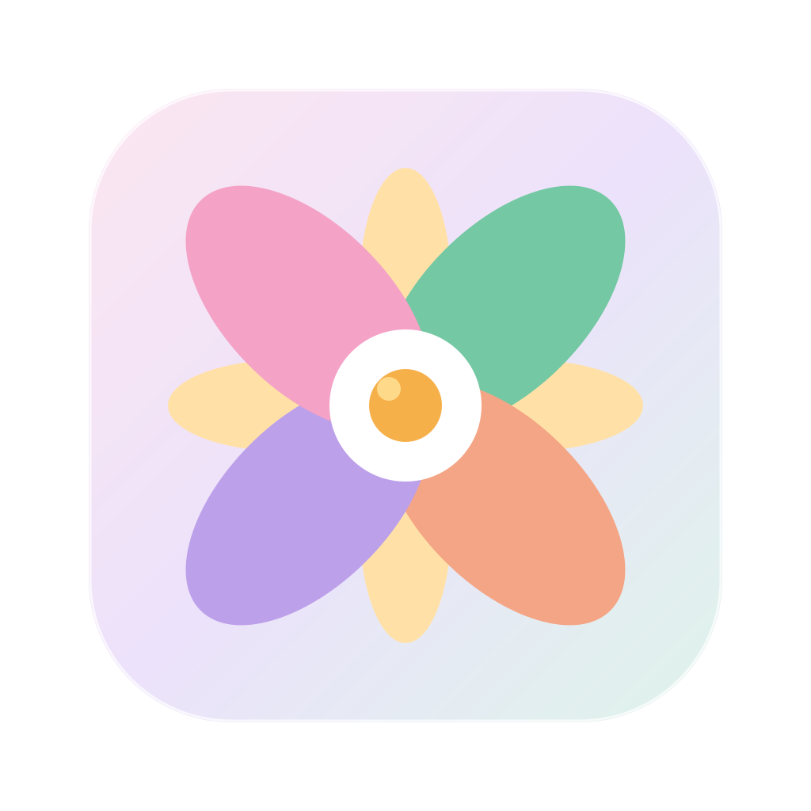

<p align="center">
  
</p>

<h1 align="center">Bloom</h1>

<p align="center">
  <br/>
  <em>your little keeper</em> — a calm, pastel desktop dashboard for macOS.
</p>

Bloom is a small Electron app: a free canvas where you drop **draggable, resizable cards**
for your todos, countdowns, timers, notes, and a weekly planner. Everything is auto-saved
to a local file, so it’s entirely yours — no account, no cloud, no tracking.

---

## ✨ Features

A single canvas, five kinds of cards — add as many of each as you like, then drag and
resize them anywhere.

| | Card | What it does |
|---|------|--------------|
| 🟢 | **Todo** | `Active` / `Done` tabs. Check an item and it plays a strike-through animation, then slides into `Done`. |
| 🟠 | **Countdown** | Give it a name and a date; it shows the big number of days left (or days ago). |
| 🟣 | **Timer** | Set minutes, hit start — it counts down `mm:ss` and rings a soft tone when it hits zero. |
| 🌸 | **Note** | A free-form notepad with light markdown aids: `Tab` to indent, `- ` becomes a `•` bullet, `Enter` continues the list. |
| 🔵 | **Week** | A simple Mon–Sun task board — seven day columns, today's highlighted. Add tasks per day; drag a task to reorder it or move it to another day. Check a task to clear it from the board (kept in history) or `✕` to delete it for good. Long text shows one line — click it for a popup with the full, editable text. |

Plus:

- **Rename anything** — every card has a compact name field in its header.
- **Silky drag & resize** — GPU-accelerated, 60fps pointer dragging.
- **Spellcheck everywhere** — red underlines and right-click suggestions in every text field.
- **Local-first storage** — one tidy JSON file, debounced auto-save, nothing leaves your machine.

---

## 🚀 Run it

```bash
git clone git@github.com:yuzhu9387/Bloom-your-little-keeper.git
cd Bloom-your-little-keeper
npm install
npm start
```

### Build a double-clickable Mac app

```bash
npm run dist     # produces a .dmg / Bloom.app under dist/
```

Drag `Bloom.app` into Applications and launch it like any Mac app.

### Regenerate the icon

The app icon is a vector — edit `assets/icon.svg`, then:

```bash
npm run icon     # rebuilds assets/icon.png and assets/icon.icns
```

---

## 💾 Where your data lives

All card positions, sizes, and content live in a single JSON file:

```
~/Library/Application Support/Bloom/data.json
```

Writes are debounced 500ms after your last change, so nothing is lost on quit.

---

## 🗂 Project layout

```
Bloom/
├── main.js            Electron main process — window + atomic local-file read/write + spellcheck menu
├── preload.js         Safe load/save bridge to the renderer
├── index.html         Toolbar + canvas
├── styles.css         The pastel theme
├── src/
│   ├── store.js       In-memory state + debounced persistence
│   ├── canvas.js      Pointer-based drag + resize engine (no libraries)
│   ├── sound.js       Synthesized timer ring (Web Audio)
│   ├── app.js         Wires the toolbar, card chrome, and widget dispatch
│   └── widgets/
│       ├── todo.js
│       ├── countdown-date.js
│       ├── timer.js
│       ├── note.js
│       ├── planner.js     Weekly Mon–Sun planner grid
│       └── task-row.js    Shared checkable task row (todo + planner)
├── assets/            icon.svg / icon.png / icon.icns / flyer
└── scripts/
    └── make-icon.mjs  SVG → PNG → .icns icon builder
```

---

## 🛠 Built with

[Electron](https://www.electronjs.org/) · vanilla HTML/CSS/JS (no framework, no bundler) ·
[sharp](https://sharp.pixelplumbing.com/) for icon rasterization.

<p align="center"><sub>Made with 🌷</sub></p>
